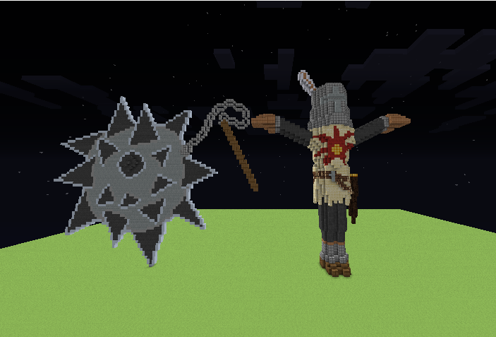
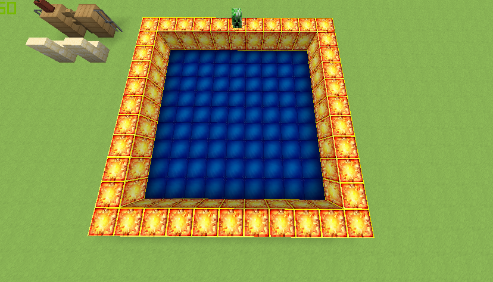
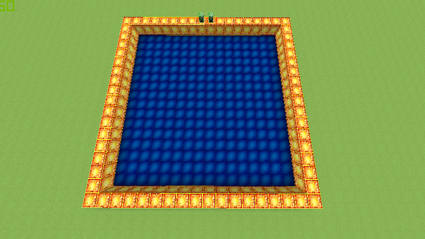
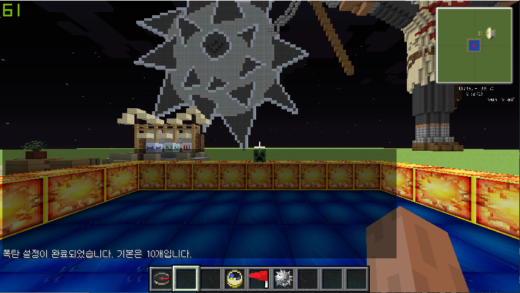
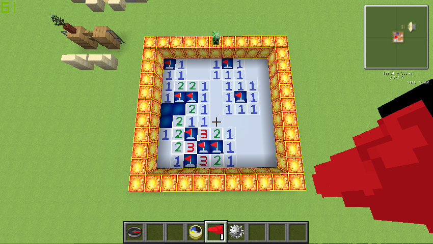
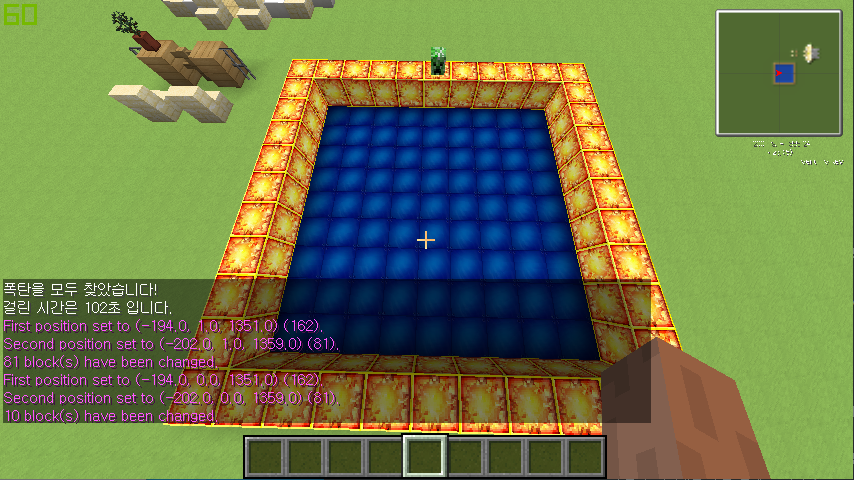

# Minesweeper
  > Version v1.0  
  > Minecraft Version : 1.5.2
  - 분류 : Map, Skript, TexturePack
## 승리 조건
  - 폭탄을 제외한 모든 칸을 클릭하여 열 것
  - 폭탄인 칸은 모두 깃발을 세워야 함
  - 폭탄을 클릭하면 패배
## 사용 플러그인
  1. Skript : 지뢰찾기 소스 제작
  2. WorldEdit : 맵 초기화
### Skript
  - /게임시작 \[난이도\]
    - 이미 게임이 실행 중이라면 return
    - 게임 시작으로 변수 조정, 플레이어 지정
    - 난이도에 따라 지뢰 갯수 설정
    - 플레이어의 인벤토리에 아이템 지급
      - 레일 ( Set the FLAG ) : 깃발 생성 / 제거
      - 뼈 ( How many bombs? ) : 남은 폭탄의 개수 보여줌
	- 폭탄 설치 커맨드 실행
	- => 플레이어가 게임을 시작할 수 있음
  - 리셋 \[난이도\]
    - 게임 시작 변수 조정 ( 게임이 실행 중이 아님 )
    - 플레이어의 인벤토리 초기화
    - 입력한 난이도의 그리드 초기화 ( 청금석 부분과 지뢰매설 부분 전체 초기화 )
  - 폭탄 \[설치 / 체크\] \[난이도\]
    - /폭탄 설치
      - WorldEdit의 확률 설치를 이용
      - 난이도에 따라 확률에 맞게 폭탄을 임의로 설치 ( 폭탄 레이어 )
      - 폭탄의 개수 체크 명령어 실행
    - 폭탄 체크
      - 그리드의 모든 칸을 순회
      - 폭탄이 설치된 칸 ( 검은 양털 ) 의 개수를 셈
      - 만약 폭탄의 개수와 난이도 기본 폭탄의 개수가 맞지 않는다면 재설치
      - 폭탄이 설치되었다는 안내메세지 후 return
    - 레일 설치 이벤트
      - 그리드 ( 청금석 ) 에 레일을 설치
        - 선택한 공간이 스펀지로 변환 ( 깃발 설치 )
        - 플레이어에게 보여지는 정보 ( 폭탄의 개수 ) 1 제거
        - 폭탄의 개수가 0이 되었다면 레일 설치 불가
        - 스펀지 위에 설치할 경우, 깃발을 제거하고 개수에 1 추가
    - 승리 조건 체크
      - 매 초 주위에 있는 청금석의 개수 연산
      - 청금석이 있다면 승리조건 미달성
    - 지뢰 확인 방법 : DFS
      - 청금석을 부수면 그 칸을 염
      - 만약 폭탄이라면 패배, 게임 종료
      - 폭탄이 아니라면 주위에 폭탄이 있는 개수를 세고, 그 칸에 숫자를 표시
      - 만약 주위 8칸에 있는 폭탄의 개수가 0개라면, DFS 방식으로 주위의 칸 또한 폭탄 연산을 시작
## 설명
  - 초급 : 9 * 9 크기의 판 / 기본 10개의 지뢰 매설
  - 중급 : 16 * 16 크기의 판 / 기본 40개의 지뢰 매설
  - 고급 : 미구현
## TexturePack
  - 지뢰 사진 ( Main picture )  
    
  - 뼈 ( Bone )
    - 지뢰의 남은 개수  
    
  - 스펀지 ( Sponge )
    - 깃발이 세워진 그리드 모양  
    
  - 레일 ( Rail )
    - 깃발 모양  
    
  - 발광석 ( lightgem )
    - 데코레이션  
    
  - 양털 ( cloth )
    - 숫자 : 주위에 폭탄이 몇개 있는지 알려줌
    - 검은색 : 폭탄 ( 사용자에게 보이진 않음 )  
      
      
      
      
      
    
## ScreenShot
    
    
    
    
    
  